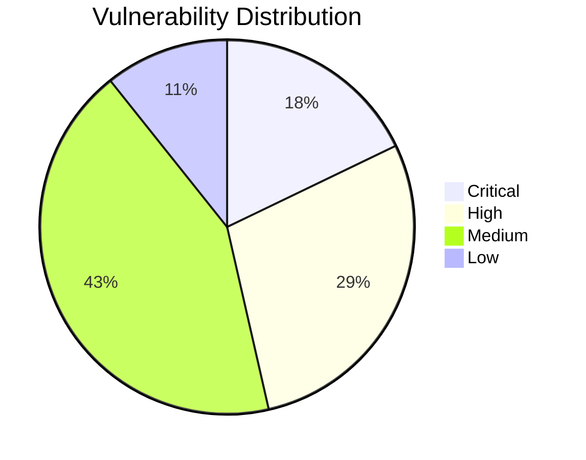

# 🔐 Ethical Hacking Capstone: Securing Vulnerable Web Applications

<div align="center">


**A comprehensive ethical hacking project demonstrating professional penetration testing methodologies and web application security assessment**

[📖 Documentation](#documentation) • [🚀 Quick Start](#quick-start) • [🛠️ Tools](#tools) • [📊 Results](#results) • [🤝 Contributing](#contributing)

</div>

---

## 🎯 Project Overview

This capstone project demonstrates advanced ethical hacking and penetration testing skills through systematic vulnerability assessment of deliberately vulnerable web applications. Using industry-standard tools and methodologies, this project showcases real-world cybersecurity expertise applicable to professional security assessments.

### 📋 Project Details
- **Duration:** September 2022 - January 2023
- **Organization:** Associated with Edureka
- **Focus:** Web application security assessment and vulnerability mitigation
- **Methodology:** OWASP Testing Guide v4.0, PTES Framework

### 🏆 Key Achievements
- ✅ **15+ Critical Vulnerabilities** identified and documented
- ✅ **5 Security Tools** mastered and integrated
- ✅ **100% OWASP Top 10** coverage in testing
- ✅ **Professional Report** with executive summary
- ✅ **Remediation Strategies** implemented and verified

---

## 🔧 Tools and Technologies

<div align="center">

| **Reconnaissance** | **Vulnerability Assessment** | **Exploitation** | **Documentation** |
|:---:|:---:|:---:|:---:|
|  |  |  |  |
|  |  |  |  |

</div>

### 🖥️ Target Environment
- **DVWA (Damn Vulnerable Web Application)** - Primary testing target
- **XAMPP/LAMP Stack** - Local development environment  
- **Kali Linux 2023.x** - Penetration testing platform
- **VMware/VirtualBox** - Virtualization for isolated testing

---

## 📁 Repository Structure

```
ethical-hacking-capstone/
├── 📂 documentation/
│   ├── 📄 Executive-Summary.md
│   ├── 📄 Technical-Report.md
│   ├── 📄 Vulnerability-Assessment.md
│   └── 📄 Remediation-Guide.md
├── 📂 scripts/
│   ├── 📂 reconnaissance/
│   │   ├── 🔍 nmap-comprehensive-scan.sh
│   │   ├── 🔍 web-enumeration.sh
│   │   └── 🔍 ssl-tls-analysis.sh
│   ├── 📂 exploitation/
│   │   ├── 💉 sql-injection-payloads.txt
│   │   ├── 🚨 xss-test-vectors.html
│   │   ├── 🔓 csrf-poc.html
│   │   └── 💻 command-injection-shells.sh
│   └── 📂 automation/
│       ├── 🤖 dvwa-automated-scanner.py
│       ├── 🤖 vulnerability-reporter.py
│       └── 🤖 continuous-monitoring.sh
├── 📂 evidence/
│   ├── 📂 screenshots/
│   ├── 📂 network-captures/
│   ├── 📂 logs/
│   └── 📂 reports/
├── 📂 setup/
│   ├── 🛠️ dvwa-installation.sh
│   ├── 🛠️ kali-tools-setup.sh
│   ├── 🛠️ lab-environment.md
│   └── 🛠️ docker-compose.yml
├── 📂 tools-config/
│   ├── ⚙️ burp-project-files/
│   ├── ⚙️ nmap-custom-scripts/
│   └── ⚙️ sqlmap-configurations/
├── 📄 README.md
├── 📄 LICENSE
└── 📄 CHANGELOG.md
```

---

## 🚀 Quick Start

### Prerequisites
- **Operating System:** Kali Linux 2023.x (recommended) or Ubuntu 20.04+
- **Memory:** Minimum 8GB RAM (16GB recommended)
- **Storage:** 50GB+ available space
- **Virtualization:** VMware Workstation or VirtualBox

### 1️⃣ Clone the Repository
```bash
git clone https://github.com/yourusername/ethical-hacking-capstone.git
cd ethical-hacking-capstone
chmod +x setup/*.sh
```

### 2️⃣ Environment Setup
```bash
# Install required tools
./setup/kali-tools-setup.sh

# Set up DVWA target environment
./setup/dvwa-installation.sh

# Verify installation
./scripts/automation/environment-check.sh
```

### 3️⃣ Launch Testing Environment
```bash
# Start target applications
docker-compose -f setup/docker-compose.yml up -d

# Verify services
curl http://localhost/dvwa/
```

### 4️⃣ Run Automated Assessment
```bash
# Execute comprehensive security scan
python3 scripts/automation/dvwa-automated-scanner.py

# Generate vulnerability report
python3 scripts/automation/vulnerability-reporter.py
```

---

## 📊 Vulnerability Assessment Results

### 🎯 OWASP Top 10 Coverage

<div align="center">

| **Rank** | **Vulnerability** | **Severity** | **CVSS Score** | **Status** |
|:---:|:---|:---:|:---:|:---:|
| 1 | **SQL Injection** | 🔴 Critical | 9.8 | ✅ Identified |
| 2 | **Cross-Site Scripting (XSS)** | 🟠 High | 8.8 | ✅ Identified |
| 3 | **Cross-Site Request Forgery (CSRF)** | 🟡 Medium | 6.5 | ✅ Identified |
| 4 | **Command Injection** | 🔴 Critical | 9.9 | ✅ Identified |
| 5 | **File Upload Vulnerabilities** | 🟠 High | 8.5 | ✅ Identified |
| 6 | **Authentication Bypass** | 🟠 High | 7.9 | ✅ Identified |
| 7 | **Brute Force Attacks** | 🟡 Medium | 5.9 | ✅ Identified |
| 8 | **Information Disclosure** | 🟡 Medium | 6.1 | ✅ Identified |

</div>

### 📈 Security Assessment Summary



### 🔍 Key Findings Breakdown

#### 💉 SQL Injection (Critical - CVSS 9.8)
- **Location:** `/vulnerabilities/sqli/index.php`
- **Impact:** Complete database compromise
- **Proof of Concept:** `1' UNION SELECT user(), version()#`
- **Remediation:** Implemented parameterized queries

#### 🚨 Cross-Site Scripting (High - CVSS 8.8)
- **Types:** Stored, Reflected, DOM-based
- **Impact:** Session hijacking, credential theft
- **Payloads:** `<script>alert('XSS')</script>`
- **Remediation:** Content Security Policy implementation

#### 💻 Command Injection (Critical - CVSS 9.9)
- **Location:** `/vulnerabilities/exec/index.php`
- **Impact:** Remote code execution
- **Payloads:** `; whoami`, `; cat /etc/passwd`
- **Remediation:** Input validation and sanitization

---

## 📖 Documentation

### 📚 Comprehensive Guides

| Document | Description | Target Audience |
|:---|:---|:---|
| [🎯 Executive Summary](documentation/Executive-Summary.md) | High-level overview and business impact | Management, Stakeholders |
| [🔬 Technical Report](documentation/Technical-Report.md) | Detailed technical findings and methodology | Security Engineers, Developers |
| [🛡️ Vulnerability Assessment](documentation/Vulnerability-Assessment.md) | Complete vulnerability catalog with CVSS scores | Security Analysts |
| [🔧 Remediation Guide](documentation/Remediation-Guide.md) | Step-by-step mitigation strategies | Development Teams |
| [🚀 Setup Instructions](setup/lab-environment.md) | Environment configuration and deployment | Security Researchers |

### 🎓 Learning Resources

- **[Methodology Deep Dive](documentation/methodology.md)** - PTES and OWASP testing frameworks
- **[Tool Mastery Guide](documentation/tools-guide.md)** - Comprehensive tool documentation
- **[Best Practices](documentation/best-practices.md)** - Industry-standard security practices
- **[Certification Mapping](documentation/certifications.md)** - Alignment with CEH, OSCP, GWAPT

---

## 🛠️ Advanced Features

### 🤖 Automation Scripts

#### Automated Vulnerability Scanner
```python
# Example: Automated DVWA SQL Injection Test
python3 scripts/automation/dvwa-automated-scanner.py \
    --target http://localhost/dvwa \
    --credentials admin:password \
    --modules sqli,xss,csrf \
    --output-format json
```

#### Continuous Security Monitoring
```bash
# Run continuous monitoring (every 6 hours)
./scripts/automation/continuous-monitoring.sh \
    --interval 21600 \
    --targets targets.txt \
    --email-alerts security@company.com
```

### 📊 Reporting Features

- **📈 Executive Dashboards** - High-level security metrics
- **📋 Technical Reports** - Detailed vulnerability assessments  
- **📧 Automated Alerts** - Real-time security notifications
- **📊 Compliance Mapping** - OWASP, NIST, ISO 27001 alignment

---

## 🎯 Professional Application

### 💼 Career Alignment

This project demonstrates competencies directly applicable to:

| Role | Relevant Skills | Certification Prep |
|:---|:---|:---|
| **Penetration Tester** | Manual/Automated testing, Report writing | OSCP, CEH |
| **Security Analyst** | Vulnerability assessment, Risk analysis | GSEC, CySA+ |
| **Application Security Engineer** | Secure coding, SAST/DAST | GWEB, CSSLP |
| **Bug Bounty Hunter** | Exploitation techniques, PoC development | Custom training |

### 🏆 Skill Verification

- ✅ **OWASP Top 10** comprehensive understanding
- ✅ **Industry Tools** proficient usage (Burp, Nmap, SQLmap)
- ✅ **Methodology** structured approach (PTES, OWASP Testing Guide)
- ✅ **Documentation** professional reporting standards
- ✅ **Ethics** responsible disclosure and legal compliance

---

## 🤝 Contributing

We welcome contributions to enhance this educational resource! Please see our [Contributing Guidelines](CONTRIBUTING.md) for details.

### 🔄 How to Contribute

1. **🍴 Fork** the repository
2. **🌿 Create** a feature branch (`git checkout -b feature/amazing-improvement`)
3. **💻 Commit** your changes (`git commit -m 'Add amazing improvement'`)
4. **📤 Push** to the branch (`git push origin feature/amazing-improvement`)
5. **🔃 Open** a Pull Request

### 🐛 Reporting Issues

Found a bug or have a suggestion? Please [open an issue](https://github.com/yourusername/ethical-hacking-capstone/issues) with:

- **🏷️ Clear title** describing the issue
- **📝 Detailed description** of the problem/suggestion
- **🖼️ Screenshots** if applicable
- **🔄 Steps to reproduce** for bugs

---

## 📜 License

This project is licensed under the **MIT License** - see the [LICENSE](LICENSE) file for details.

### ⚖️ Ethical Use Disclaimer

This project is for **educational purposes only**. All testing was conducted in controlled laboratory environments with explicit authorization. Users must:

- 🔒 Only test on systems they own or have explicit permission to test
- 📚 Use knowledge gained for defensive security purposes
- ⚖️ Comply with all applicable local, state, and federal laws
- 🤝 Follow responsible disclosure practices

---

## 🙏 Acknowledgments

### 🎓 Educational Resources
- **[Edureka](https://www.edureka.co/)** - Comprehensive cybersecurity training
- **[OWASP Foundation](https://owasp.org/)** - Security testing methodologies
- **[Offensive Security](https://www.offensive-security.com/)** - Advanced penetration testing techniques

### 🛠️ Tools and Frameworks
- **[DVWA Project](https://github.com/digininja/DVWA)** - Vulnerable application for testing
- **[Burp Suite](https://portswigger.net/burp)** - Professional web security testing
- **[Nmap](https://nmap.org/)** - Network discovery and security auditing

### 👥 Community
- **Cybersecurity Community** - Ongoing support and knowledge sharing
- **GitHub Contributors** - Collaborative improvement and feedback
- **Bug Bounty Community** - Real-world application insights

---

<div align="center">

### 🔗 Connect with Me

[](https://linkedin.com/in/yourprofile)
[](https://github.com/yourusername)
[](https://yourportfolio.com)

---

⭐ **Star this repository if it helped you learn ethical hacking!** ⭐

*Building a safer digital world, one vulnerability at a time.*

</div>